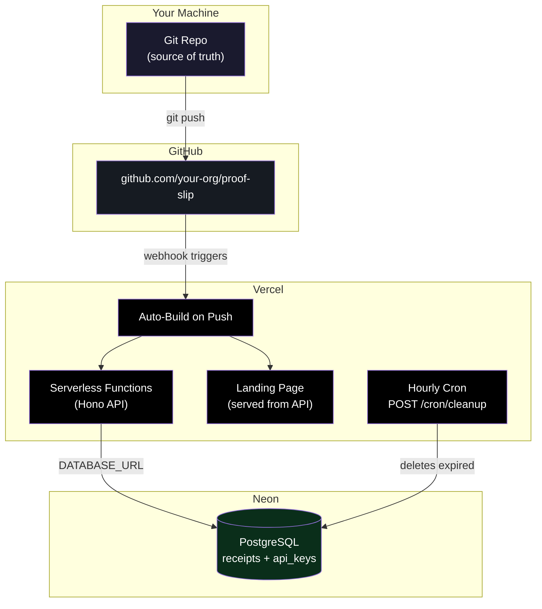
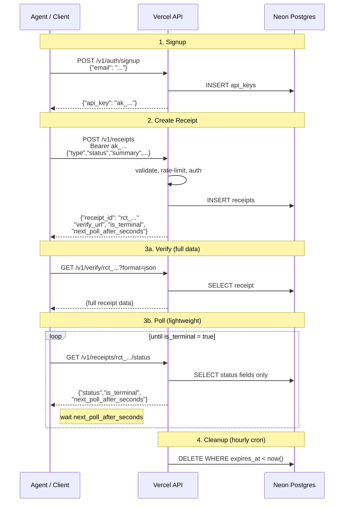

# ProofSlip

**Portable proof objects for agent workflows.**

24-hour ephemeral receipts that let agents verify what happened before deciding what happens next. Create a receipt, check it later, let it expire. That's it.

> Agents should not continue based on assumptions when they can continue based on receipts.

## The Problem

Agentic workflows break in predictable ways: duplicate side effects, unclear approval states, unsafe retries, ambiguous resumability. Teams currently solve this with raw logs, brittle flags, ad hoc DB rows, and hand-rolled retry logic.

ProofSlip replaces all of that with a single primitive: a short-lived, machine-readable receipt — a **portable proof object** that travels with the workflow and answers the questions agents actually ask:

- Did this action already happen?
- Was the request approved?
- Is retry safe?
- Should I continue, wait, or escalate?

## How It Works

```
1. Agent completes a step → creates a receipt (POST /v1/receipts)
2. Next agent (or same agent later) → verifies the receipt before acting
3. Receipt expires after 24 hours → no cleanup burden
```

Every receipt includes polling guidance (`is_terminal`, `next_poll_after_seconds`) so agents know whether to stop, wait, or keep checking.

## Receipt Types

| Type | Use Case |
|------|----------|
| `action` | Record that something happened (always terminal) |
| `approval` | Track pending/approved/rejected decisions |
| `handshake` | Two agents confirming shared context |
| `resume` | Bookmark for safe workflow continuation |
| `failure` | Structured failure with retry guidance (always terminal) |

## Quick Start

### 1. Get an API Key

```bash
curl -X POST https://proofslip.ai/v1/auth/signup \
  -H "Content-Type: application/json" \
  -d '{"email": "you@example.com"}'
```

Save the returned key immediately — it cannot be retrieved later.

### 2. Create a Receipt

```bash
curl -X POST https://proofslip.ai/v1/receipts \
  -H "Authorization: Bearer ak_your_key_here" \
  -H "Content-Type: application/json" \
  -d '{
    "type": "action",
    "status": "success",
    "summary": "Sent welcome email to user@example.com",
    "ref": {
      "workflow_id": "onboarding-123",
      "agent_id": "email-agent"
    }
  }'
```

Returns:

```json
{
  "receipt_id": "rct_abc123...",
  "type": "action",
  "status": "success",
  "summary": "Sent welcome email to user@example.com",
  "verify_url": "https://proofslip.ai/verify/rct_abc123...",
  "created_at": "2026-03-25T12:00:00.000Z",
  "expires_at": "2026-03-26T12:00:00.000Z",
  "is_terminal": true,
  "next_poll_after_seconds": null
}
```

### 3. Verify Before Acting

```bash
# JSON (for agents)
curl https://proofslip.ai/v1/verify/rct_abc123?format=json

# HTML (for humans — paste the verify_url in a browser)
```

### 4. Poll Non-Terminal Receipts

For approval workflows where a receipt starts as `pending`:

```bash
# Lightweight status check (no payload, no ref — just state)
curl https://proofslip.ai/v1/receipts/rct_abc123/status
```

```json
{
  "receipt_id": "rct_abc123...",
  "status": "pending",
  "is_terminal": false,
  "next_poll_after_seconds": 30,
  "expires_at": "2026-03-26T12:00:00.000Z"
}
```

## API Reference

| Method | Endpoint | Auth | Description |
|--------|----------|------|-------------|
| `POST` | `/v1/receipts` | API Key | Create a receipt |
| `GET` | `/v1/verify/:id` | None | Verify a receipt (JSON or HTML) |
| `GET` | `/verify/:id` | None | Shortcut verify (same behavior) |
| `GET` | `/v1/receipts/:id/status` | None | Lightweight polling endpoint |
| `POST` | `/v1/auth/signup` | None | Get an API key |
| `GET` | `/health` | None | Health check |

### Create Receipt Fields

| Field | Required | Description |
|-------|----------|-------------|
| `type` | Yes | `action`, `approval`, `handshake`, `resume`, `failure` |
| `status` | Yes | Any string (e.g. `success`, `pending`, `rejected`) |
| `summary` | Yes | Human-readable description, max 280 chars |
| `payload` | No | Structured JSON data, max 4KB |
| `ref` | No | Workflow references: `run_id`, `agent_id`, `action_id`, `workflow_id`, `session_id` |
| `expires_in` | No | TTL in seconds (60–86400). Default: 86400 (24h) |
| `idempotency_key` | No | Prevents duplicate receipts on retry |
| `audience` | No | Set to `"human"` to enrich the verify page with OG/Twitter social card meta tags |

### Rate Limits

| Endpoint | Limit | Scope |
|----------|-------|-------|
| `POST /v1/receipts` | 60/min | Per API key |
| `GET /v1/verify/:id` | 120/min | Per IP |
| `GET /v1/receipts/:id/status` | 120/min | Per IP |
| `POST /v1/auth/signup` | 5/min | Per IP |

Rate limit headers (`X-RateLimit-Limit`, `X-RateLimit-Remaining`, `X-RateLimit-Reset`) are included on every response.

### Idempotency

Include an `idempotency_key` to safely retry receipt creation. If a receipt with the same key already exists and the content matches, the original receipt is returned. If the content differs, you'll get a `409 idempotency_conflict` error.

## Self-Hosting

### Prerequisites

- Node.js 18+
- PostgreSQL (Neon recommended, any Postgres works)

### Setup

```bash
git clone https://github.com/your-org/proof-slip.git
cd proof-slip
npm install

# Configure environment
cp .env.example .env
# Edit .env with your DATABASE_URL and BASE_URL

# Run migrations
npm run db:migrate

# Seed an API key
npm run db:seed -- you@example.com

# Start dev server
npm run dev
```

### Environment Variables

| Variable | Required | Description |
|----------|----------|-------------|
| `DATABASE_URL` | Yes | Postgres connection string |
| `BASE_URL` | Yes | Public URL (used in `verify_url` generation) |
| `CRON_SECRET` | Production | Bearer token for the cleanup cron endpoint |
| `RESEND_API_KEY` | Production | Resend API key for emailing API keys to web signups |
| `DEV_SECRET` | Optional | Secret key to access `/dev/console` test page |
| `NODEJS_HELPERS` | Production | Set to `0` (required for Hono zero-config on Vercel) |

### Scripts

| Command | Description |
|---------|-------------|
| `npm run dev` | Start local dev server (port 3000, hot reload) |
| `npm test` | Run test suite |
| `npm run db:generate` | Generate migrations from schema changes |
| `npm run db:migrate` | Run database migrations |
| `npm run db:seed -- <email>` | Create an API key for the given email |

## Deployment Architecture



**Environment variables on Vercel:**
| Variable | Where to set |
|----------|-------------|
| `DATABASE_URL` | Vercel → Settings → Environment Variables (copy from Neon dashboard) |
| `BASE_URL` | `https://proofslip.ai` (or your custom domain) |
| `CRON_SECRET` | Generate a random token, set in Vercel env vars |
| `NODEJS_HELPERS` | Set to `0` (required for Hono zero-config deployment) |

## API Request/Response Flows



## Architecture

```
src/
├── index.ts              # Hono app, middleware chain, routing
├── dev.ts                # Local dev server
├── db/
│   ├── schema.ts         # Drizzle schema (receipts, api_keys)
│   ├── client.ts         # Neon DB connection
│   └── migrate.ts        # Migration runner
├── routes/
│   ├── receipts.ts       # POST /v1/receipts
│   ├── verify.ts         # GET /verify/:id, /v1/verify/:id
│   ├── status.ts         # GET /v1/receipts/:id/status
│   ├── auth.ts           # POST /v1/auth/signup
│   └── cron.ts           # POST /cron/cleanup
├── middleware/
│   ├── api-key-auth.ts   # Bearer token → hash validation
│   ├── rate-limit.ts     # Per-key and per-IP rate limiting
│   ├── security.ts       # CORS, headers, body limits
│   └── logger.ts         # Structured JSON request logging
├── lib/
│   ├── ids.ts            # nanoid generators (rct_, key_, req_)
│   ├── hash.ts           # SHA-256 hashing
│   ├── validate.ts       # Input validation
│   ├── polling.ts        # Terminal state detection, poll intervals
│   ├── rate-limit.ts     # In-memory sliding window tracker
│   └── errors.ts         # Error response builder
└── views/
    ├── font.ts           # Departure Mono as inline base64
    ├── og-image.ts       # Branded SVG for social cards
    ├── landing-page.ts   # HTML homepage
    ├── verify-page.ts    # Receipt display (shareable, OG tags when audience=human)
    └── not-found-page.ts # 404 receipt page
```

**Stack**: Hono + Drizzle ORM + Neon Postgres + Vercel Serverless (zero-config)

## Design Principles

- **Ephemeral by default.** 24-hour TTL. Not a long-term archive.
- **Machine + human readable.** JSON for agents, styled HTML for browsers. Same URL.
- **Cheap to run.** Serverless, auto-expiring data, minimal storage footprint.
- **Simple mental model.** Create. Verify. Expire. Three operations.
- **Idempotent by design.** Safe retries built into the protocol.

## License

ISC
